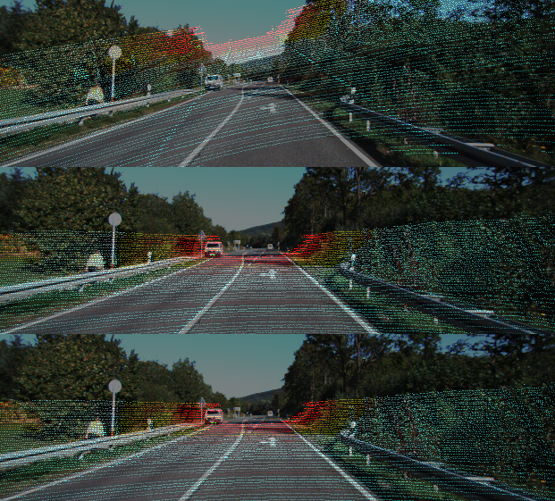
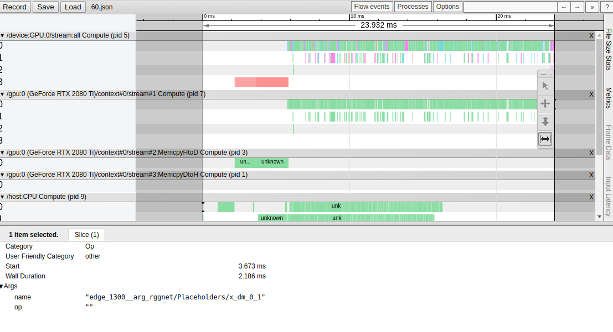

# RGGNet

Here's the official implementation of the Paper:  [Yuan, Kaiwen, Zhenyu Guo, and Z. Jane Wang. "RGGNet: Tolerance Aware LiDAR-Camera Online Calibration with Geometric Deep Learning and Generative Model." IEEE Robotics and Automation Letters (2020).](https://ieeexplore.ieee.org/abstract/document/9206138).


## Hardware Requirements

| Item | Version|
|---|---|
| System | Ubuntu 16.04 or 18.04 (x86), referring to [MACHINE-SETUP.md](MACHINE-SETUP.md) to install the system|
| SSD | 2T |
| GPU Memory | >= 11 GB |

## Main Software Requirements

| Item | Version|
|---|---|
| Python | 3.7.x |
| CUDA  | 10.0 |
| cuDNN| v7.4.2|
| Tensorflow-GPU | 1.14 |
| Opencv | 4.2  |

## Setup

#### Without Docker
Please be aware that, I have only tested the old-school way in ubuntu 16 machine. I strongly not recommend you do that due to this community is fast moving and 
many dependencies may be broken, e.g., tensorflow 1.x is dying and CUDA/NVIDIA Driver is no cheap to fix if you mess up with your local environment, even if you use 
Anaconda.

OK. If you choose to do so without docker, .... 

Make sure you have Anaconda installed, then simply do the following:

```
bash install_dependencies_conda.sh
```

#### With Docker

For docker folks, make sure in your host machine, you have NVIDIA-docker installed. Then, what you need do is simply:

```
make build
```

Ta Da! You shall have a docker image named `rggnet-docker` like the following:

```
REPOSITORY            TAG                             IMAGE ID            CREATED             SIZE
rggnet-docker         latest                          xxxxxxxxxxx        xxx minutes ago      5.99GB
```

## Prepare Datasets

OK, first of all, you shall download the KITTI datasets:

- [X] Navigate to training_data_serialization
- [X] Copy [bash script](training_data_serialization/download.sh) to where you wanna download the data (1-2 TB SSD recommended)
- [X] Run the bash `bash download.sh` to download the `sequence 26_09` to your file dir (and this may take a while, like, a really long while depending on your network speeeeeed)
- [X] Manually split the training and testing datasets, and here's how my folder setup look like (`tree $(YOUR_FOLDER}/kitti/raw/ -L 3`):

```
├── test
│   └── 2011_09_26
│       ├── 2011_09_26_drive_0005_sync
│       ├── 2011_09_26_drive_0070_sync
│       ├── calib_cam_to_cam.txt
│       ├── calib_imu_to_velo.txt
│       └── calib_velo_to_cam.txt
└── train
    ├── 2011_09_26
    │   ├── 2011_09_26_drive_0001_sync
    │   ├── 2011_09_26_drive_0002_sync
    │   ├── .......
    │   ├── 2011_09_26_drive_0117_sync
    │   ├── calib_cam_to_cam.txt
    │   ├── calib_imu_to_velo.txt
    │   └── calib_velo_to_cam.txt
    └── download.sh
```

Next, go to the [Makefile](Makefile) to update the `-v ${PWD}/kitti:/root/kitti \`  so that it mounts your `$(YOUR_FOLDER}/kitti` to the docker container.
For example, if you download your datasets in `/media/ubuntu/kitti`, then you shall that line as  `-v /media/ubuntu/kitti:/root/kitti \`, so that your `make run`
command looks like this:

```
run:
	docker run -it \
        --runtime=nvidia \
        --net=host \
        --privileged=true \
        --ipc=host \
        --volume="/tmp/.X11-unix:/tmp/.X11-unix:ro" \
        --env="DISPLAY" \
        --env="QT_X11_NO_MITSHM=1" \
        --hostname="inside-DOCKER" \
        --name="rggnet-experiment" \
        -v ${PWD}:/root/rggnet \
        -v /media/ubuntu/kitti:/root/kitti \
      	rggnet-docker bash
```

Then, simply do

```
make run
```

You shall enter a container with everything set-up, including the raw data.

Lastly, let's create tfrecords!

```
cd /root/rggnet/training_data_serialization
make create-data-16 # or create-data-64
```

It shall generate the following tfrecords for you:

| Item | Number| Size | Rot off range|   Trans off range|
|---|---|---|---|---|
| Training 1 | 24000 (26_09, ex 0005/0070)|  630 GB|+/- 15 deg | +/- 0.2 m |
| Training 2 | 4000 (26_09, ex 0005/0070)|  630 GB|+/- 0.00001   deg | +/- 0.3 m |
| Training 3 | 4000 (26_09, ex 0005/0070)|  630 GB|+/- 20 deg | +/- 0.00001   m |
| Training ex | 2000 (03_10, 0027)|  52 GB|+/- 2 deg| +/- 0.3 m|
| T1 | 2000 (26_09, 0005/0070) | 52 GB|+/- 15 deg | +/- 0.2 m|
| T2a | 2000 (26_09, ex 0005/0070) | 52 GB|+/- 10 deg | +/- 0.2 m|
| T2b | 2000 (26_09, 0005/0070) |  52 GB|+/- 10 deg| +/- 0.2 m|
| T3 | 2000 (03_10, 0027) |  52 GB|+/- 2 deg| +/- 0.3 m|

## Run Training 

| Model | Commands| 
|---|---|
| VAE | make awesome-train-vae| 
| alpha-RGGNet | make awesome-train-rggnet-novae |
| RGGNet | make awesome-train-rggnet # You will need to modify the dir of the VAE pre-trained |
| RGGNet-3dstn | make awesome-train-rggnet-3dstn |

## Run Testing

For the best practice, we will need to build an inference graph and load the weights, setting is_training flag to False
so that the batch-normalization layers are converted to FusedBatchNorm Ops. And, come on, let's do this in a clean way.

The good thing is that all models above are sharing the same graph, namely, we can just use a sharing model to do that.

### Build Inference Graph and Load Weights

Assuming, you have finished a training with rggnet, whose the experiment id is `${experiment_id}`. 

Then run the following to create a frozen inference graph.

RGGNet:

```
export CUDA_VISIBLE_DEVICES= && python -m training.apps.production process \
--config_fp ../config/rggnet.yaml \
--from_dir save/rggnet/${experiment_id}/ \
--to_dir prod/rggnet \
--to_name best
```

Then you shall find a 232.6 MB frozen pb file in prod sub-folders. And congrats, you don't need to worry about the checkpoints any more!

Take the protobuf and use it! The following tensor names and the protobuf is all you need!

```
tensors:
  inputs:
    - 'rggnet/Placeholders/x_dm:0'
    - 'rggnet/Placeholders/x_cam:0'
  outputs:
    - 'rggnet/Forward/Regressor/y_hat_se3param:0'
```

### Run Evaluation App

The evaluator can evaluate one test for one model at once. So, config the test dir and add that info to the res_fp.

For example, RGGNet for T2b, first, go to change `training/config/inference.yaml` and then run the following:

```
export CUDA_VISIBLE_DEVICES= && python -m training.apps.evaluator process \
--config_fp ../config/inference.yaml \
--model_name rggnet \
--res_fp report
```

## Run Server

Yeah yeah yeah. Til now, you have successfully done the evaluations and got some cold numbers... But that's not intuitive, at all!

I wanna see it! Then just do the following:

```
cd server & make run-fs-mode-gpu-rggnet-plus 
```

And you shall see some visualization generated in the folder you configured. You can easily extend this to some web server or ROS node. Do it on your own.

One example of 0070_r10_t02 (0070 drive, rot off range 10 deg and trans 0.2 m):
(from top to bom: init, rggnet, gt)



#### Play with the pretrained model

Download the pre-trained [RGGNet++ (16 lines version)](https://drive.google.com/drive/folders/11exNnQ11vvHL9Tk2B2d71Wqam9-Cj5DN?usp=sharing), and extract it
under the `training/prod`, namely:

```
training
 - prod
   - rggnet_plus
     - best.pb
```

Then use the default `server/config.yaml`, you shall be able to run visualizations with:

```
cd server & make run-fs-mode-gpu-rggnet-plus 
```

The visualizations shall be shown in `/root/kitti/server/results`.

## Profile

Since all networks share the same forward graph, the profile shall be the same:

On GTX 2080Ti, it runs 24ms.



### Citation

```
@article{yuan2020rggnet,
  title={RGGNet: Tolerance Aware LiDAR-Camera Online Calibration with Geometric Deep Learning and Generative Model},
  author={Yuan, Kaiwen and Guo, Zhenyu and Wang, Z Jane},
  journal={IEEE Robotics and Automation Letters},
  year={2020},
  publisher={IEEE}
}
```

### Clarification

This repo is a refactored version based on my internal experimental repository (which is really messy) for my publications. If you see potential issues/bugs or have questions regarding my works, please 
feel free to email me ([kaiwen@ece.ubc.ca](kaiwen@ece.ubc.ca)). If you have software issues such as docker, Makefile, CUDA, tensorflow, ...., please just google it and I trust you shall figure it out eventually.
